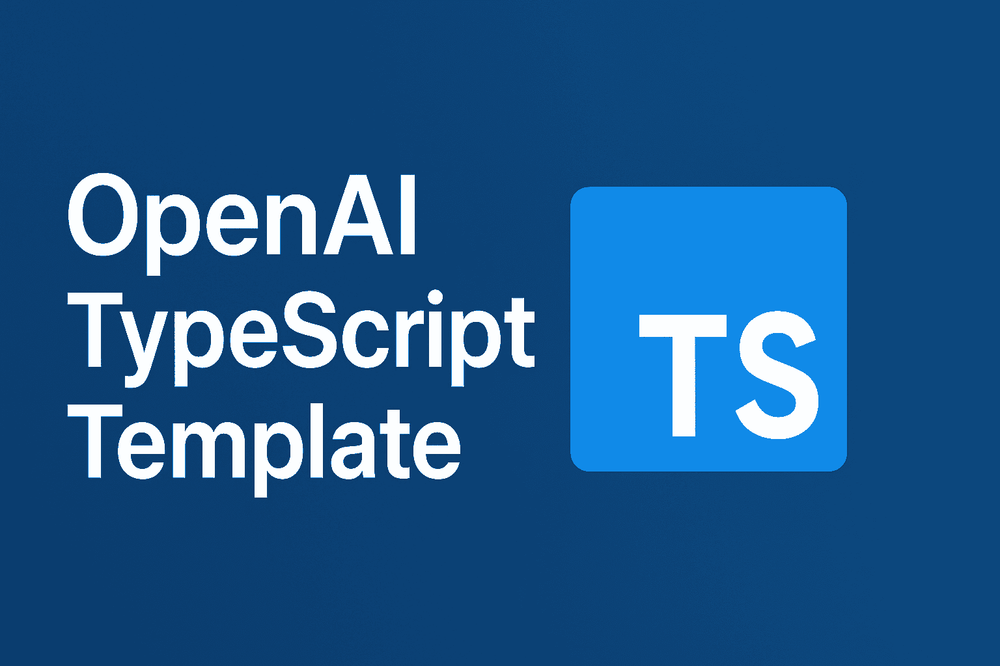

# OpenAI TypeScript Template

TypeScript template for OpenAI applications with modern tooling.



## Setup

```bash
pnpm install
cp .env.example .env
# Add OPENAI_API_KEY and DATABASE_URL
pnpm dev || npx tsx src/index.ts
```

## Database Setup

Enable pgvector extension (Neon/Supabase/Local):

```sql
-- Enable vector extension
CREATE EXTENSION IF NOT EXISTS vector;

-- Verify extension is enabled
SELECT * FROM pg_extension WHERE extname = 'vector';
```

Then run: `pnpm db:push`

## Scripts

- `pnpm dev` - Development
- `pnpm build` - Build
- `pnpm start` - Production
- `pnpm db:push` - Push schema
- `pnpm db:studio` - Drizzle Studio
- `pnpm lint:fix` - Fix linting
- `pnpm format` - Format code

## Environment Variables

- `OPENAI_API_KEY` - OpenAI API key
- `DATABASE_URL` - PostgreSQL connection string from Neon/Supabase/Local/Selfhosted
